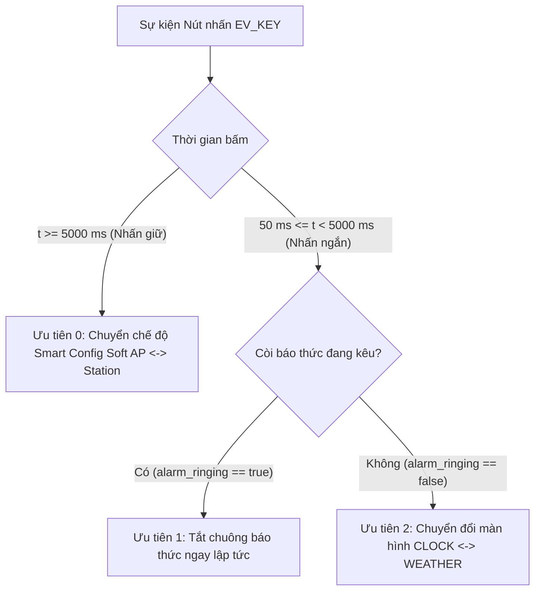

# SMART WEATHER ALARM CLOCK — v2.0

> **Tác giả:** Lê Phúc Tài  
> **Phiên bản:** v2.0 (Industrial IoT & Linux Subsystem Architecture)  
> **Phần cứng mục tiêu:** Raspberry Pi Zero 2W (Broadcom BCM2837 SoC, Quad-Core ARM Cortex-A53 @ 1.0 GHz, 512 MB LPDDR2)  
> **Hệ điều hành:** Custom Embedded Linux (Yocto Project Poky 5.0 LTS Scarthgap, Linux Kernel 6.6.63 LTS, 32-bit ARMv7-A)  

---

## 1. Giới thiệu Kiến trúc Phiên bản v2.0

**Smart Weather Alarm Clock v2.0** là phiên bản nâng cấp toàn diện hướng tới chuẩn thiết bị công nghiệp (Industrial IoT Edge Device). Phiên bản này tập trung vào tính tin cậy cao, chuẩn hóa giao tiếp phần cứng thông qua các subsystem chính thức của Linux kernel, tối ưu hóa băng thông I2C bus và mở rộng kết nối đám mây (Cloud IoT) hai chiều:

1. **Chuẩn hóa Driver Nút nhấn qua Linux Input Subsystem (`evdev`):**
   * Driver nút bấm (`btn_driver.c`) sử dụng `struct input_dev`, sinh mã sự kiện chuẩn Linux `EV_KEY` (`KEY_POWER`) truyền qua node `/dev/input/event*`.
   * Ứng dụng không gian người dùng đọc sự kiện bằng API input chuẩn (`struct input_event`), giúp tách biệt hoàn toàn logic phần cứng khỏi ứng dụng.
2. **Theo dõi thông số Driver qua Sysfs (`sysfs telemetry`):**
   * Cung cấp 2 node `/sys/devices/platform/smartclock_button/press_count` (đếm số lần nhấn) và `debounce_drops` (số ngắt rung được lọc). Giúp kỹ sư kiểm tra trạng thái hoạt động của phím trực tiếp từ dòng lệnh mà không cần debug log.
3. **Bảo vệ Hệ thống bằng Hardware Watchdog (`/dev/watchdog`):**
   * Kích hoạt watchdog phần cứng của chip Broadcom BCM2835 với chu kỳ timeout 15 giây.
   * Luồng chính của ứng dụng ping heartbeat mỗi 1 giây; nếu xảy ra lỗi treo luồng hoặc deadlock quá 15 giây, chip sẽ tự động reset phần cứng.
   * Cơ chế tắt an toàn: Khi nhận tín hiệu dừng (`SIGINT`/`SIGTERM`), ứng dụng gửi ký tự `'V'` (magic close) để tắt watchdog mà không gây reboot ngoài ý muốn.
4. **Tối ưu truyền dữ liệu OLED qua cơ chế Dirty-Page:**
   * Màn hình OLED SSD1306 được quản lý thông qua buffer bóng (shadow buffer). Ứng dụng so sánh từng page (8 pixel chiều cao) trước khi gửi qua bus I2C.
   * Những page không có thay đổi (ví dụ khi chỉ có chữ số giây nhấp nháy ở giữa màn hình) sẽ được bỏ qua, giúp giảm từ 75% đến 90% lưu lượng chiếm dụng trên bus I2C, giải phóng băng thông cho các tác vụ khác.
5. **Vẽ icon Bitmap và Nguyên ngữ Đồ họa 2D bằng Số nguyên:**
   * Tích hợp thuật toán Bresenham vẽ đường thẳng và đường tròn hoàn toàn bằng phép toán số nguyên (integer-only arithmetic, không dùng `float`), tối ưu hóa tốc độ xử lý trên CPU nhúng.
   * Bộ icon bitmap 1-bit tùy biến hiển thị trạng thái kết nối Wi-Fi, Soft AP, chuông báo thức và các biểu tượng thời tiết (nắng, mây, mưa).
6. **Lấy Dữ liệu Thời tiết Thực tế qua HTTPS (Open-Meteo REST API):**
   * Sử dụng thư viện OpenSSL thiết lập kết nối mã hóa HTTPS tới `api.open-meteo.com` (miễn phí, không cần API key).
   * Tự động giải mã JSON lấy nhiệt độ, độ ẩm và ánh xạ mã WMO sang biểu tượng thời tiết trực quan.
   * Tích hợp non-blocking socket với timeout 5 giây và cơ chế tự động chuyển sang server giả lập nội bộ (mock server) khi mất mạng internet.
7. **Giám sát & Điều khiển từ xa qua MQTT (MQTT-C):**
   * Tích hợp thư viện MQTT-C siêu gọn nhẹ (~15 KB footprint), kết nối tới public broker HiveMQ (`broker.hivemq.com:1883`).
   * **Gửi dữ liệu (Publish):** Định kỳ 30 giây gửi gói tin JSON telemetry chứa nhiệt độ, độ ẩm, giờ báo thức, màn hình hiện tại và uptime lên topic `smartclock/tai/telemetry`.
   * **Nhận lệnh (Subscribe):** Lắng nghe lệnh từ topic `smartclock/tai/command` để tắt còi báo thức, cập nhật giờ hẹn giờ hoặc chuyển màn hình từ xa.

---

## 2. Kiến trúc Hệ điều hành Yocto Linux (Custom Embedded OS)

Hệ điều hành nhúng chạy trên Raspberry Pi Zero 2W được xây dựng tùy biến hoàn toàn bằng **Yocto Project (Poky 5.0 LTS Scarthgap)**:

* **Kiến trúc CPU:** **ARM 32-bit (ARMv7-A / armv7l)**  
  *(Cấu hình `MACHINE = "raspberrypi0-2w"`, tối ưu theo `cortexa7thf-neon-vfpv4`, nhân Linux được biên dịch dạng `zImage` 32-bit).*
* **Bản phân phối (Distribution):** Poky Scarthgap 5.0 LTS.
* **Linux Kernel:** Phiên bản 6.6.63 LTS.
* **Các Meta Layers được sử dụng (`bblayers.conf`):**
  1. `meta`: Core metadata từ OpenEmbedded, cung cấp cross-toolchain (GCC, Binutils, Glibc), busybox và cấu trúc hệ thống tệp cốt lõi.
  2. `meta-poky`: Cấu hình chính sách và bản phân phối Poky tham chiếu của Yocto Project.
  3. `meta-yocto-bsp`: Các Board Support Package tham chiếu tiêu chuẩn của Yocto Project.
  4. `meta-raspberrypi`: BSP chính thức cho phần cứng Raspberry Pi (chứa firmware GPU Broadcom VideoCore, kernel Pi Zero 2W, Device Tree và driver Wi-Fi/Bluetooth).
  5. `meta-openembedded/meta-oe`: Layer mở rộng cung cấp các công cụ mạng, thư viện và tiện ích dòng lệnh (`htop`, `net-tools`,...).
* **Các gói phần mềm tích hợp sẵn (`IMAGE_INSTALL`):**
  * `dropbear`: Máy chủ SSH siêu nhẹ (hoạt động mặc định tại cổng 22).
  * `wpa_supplicant`, `iw`, `wireless-regdb-static`: Bộ công cụ quản lý và kết nối mạng Wi-Fi.
  * `linux-firmware-rpidistro-bcm43436`: Firmware điều khiển chip Wi-Fi/Bluetooth Broadcom trên Pi Zero 2W.
  * `net-tools`, `htop`: Công cụ theo dõi tiến trình và cấu hình mạng.
  * `kernel-modules`, `kernel-devsrc`: Header và module nhân phục vụ nạp driver out-of-tree.
* **Giao tiếp Serial Debug (UART Console):** Kích hoạt sẵn (`ENABLE_UART = "1"`). Baud rate: **115200**, 8N1 trên chân GPIO 14 (TX) và GPIO 15 (RX).
* **Tài khoản đăng nhập mặc định:**
  * **User:** `root`
  * **Mật khẩu:** *Không có mật khẩu (trống)*

---

## 3. Sơ đồ Nối chân Phần cứng (Hardware Pinout)

| Thiết bị Ngoại vi | Chân SoC (BCM) | Chân Header (Physical Pin) | Chế độ Hoạt động / Giao thức | Chức năng |
|---|---|---|---|---|
| **Nút nhấn (Button)** | `GPIO 17` | Pin 11 | Input, Active-Low, Internal Pull-Up, Dual-Edge IRQ | Input Event `KEY_POWER` qua `/dev/input/event*` |
| **Còi Buzzer** | `GPIO 27` | Pin 13 | Output, Active-High, PWM/hrtimer 2000 Hz | Phát âm thanh chuông báo thức |
| **OLED SSD1306 SDA** | `GPIO 2` | Pin 3 | I2C-1 Data (`/dev/i2c-1`, Address `0x3C`) | Kênh truyền dữ liệu màn hình hiển thị |
| **OLED SSD1306 SCL** | `GPIO 3` | Pin 5 | I2C-1 Clock (`/dev/i2c-1`, Address `0x3C`) | Kênh xung nhịp I2C màn hình hiển thị |
| **UART Serial Debug TX** | `GPIO 14` | Pin 8 | Serial TX (115200 baud, 8N1) | Giao tiếp dòng lệnh qua cáp USB-to-TTL |
| **UART Serial Debug RX** | `GPIO 15` | Pin 10 | Serial RX (115200 baud, 8N1) | Giao tiếp dòng lệnh qua cáp USB-to-TTL |
| **Nguồn VCC (3.3V)** | `3.3V` | Pin 1 | Power Rail 3.3V | Cấp nguồn OLED, Nút nhấn, Buzzer |
| **Nối đất (GND)** | `GND` | Pin 6, 9 | Ground Rail | Tiếp địa chung toàn bộ mạch |

---

## 4. Cấu trúc Thư mục Phiên bản v2.0

```text
SmartClock/
├── README.md                          # Hướng dẫn kỹ thuật và vận hành cho phiên bản v2.0
├── OS/                                # Thư mục chứa file ảnh hệ điều hành Yocto nhúng
│   ├── README.md                      # Chi tiết cấu hình bản build Yocto và hướng dẫn nạp thẻ nhớ
│   ├── core-image-minimal-*.wic.bz2   # File ảnh đĩa bootable hoàn chỉnh (55 MB)
│   ├── core-image-minimal-*.wic.bmap  # Block map file hỗ trợ bmaptool ghi đĩa siêu tốc
│   └── core-image-minimal-*.tar.bz2   # File nén toàn bộ Rootfs hệ thống (34 MB)
├── devicetree/
│   ├── smartclock-overlay.dts         # Source Device Tree Overlay (GPIO 17, 27, I2C-1)
│   └── smartclock-overlay.dtbo        # Binary Device Tree Blob đã biên dịch
├── include/
│   └── smartclock_common.h            # Header định nghĩa dùng chung Kernel & Userspace
├── src/
│   ├── Makefile                       # Top-level Makefile biên dịch toàn bộ dự án
│   ├── driver/
│   │   ├── Makefile                   # Kbuild Makefile cho Kernel Modules
│   │   ├── btn_driver.c               # Driver nút nhấn chuẩn Linux Input Subsystem (evdev)
│   │   └── buzzer_driver.c            # Driver còi buzzer PWM hrtimer 2 kHz
│   └── app/
│       ├── Makefile                   # Makefile biên dịch ứng dụng Userspace (OpenSSL, Pthread)
│       ├── main.c                     # Khởi tạo hệ thống, hardware watchdog, điều phối luồng
│       ├── system_state.h             # Cấu trúc Shared State & Mutex boundary an toàn
│       ├── clock_screen.c/.h          # Màn hình đồng hồ (chạy timerfd 1 giây đều đặn)
│       ├── weather_screen.c/.h        # Màn hình thời tiết (Open-Meteo HTTPS / mock fallback)
│       ├── alarm_manager.c/.h         # Quản lý báo thức, kích còi, Atomic Write cấu hình
│       ├── smartconfig.c/.h           # Quản lý mạng Soft AP <-> Station, SNTP client
│       ├── webserver.c/.h             # HTTP server cấu hình nhúng (Port 8080)
│       ├── ssd1306_oled.c/.h          # Driver OLED I2C với dirty-page update & 2D primitives
│       ├── ssd1306_icons.h            # Bộ icon bitmap 1-bit (Wi-Fi, AP, chuông, thời tiết)
│       ├── mqtt_client.c/.h           # Client MQTT gửi telemetry và nhận lệnh từ xa
│       └── mqtt/                      # Thư viện MQTT-C gọn nhẹ
└── systemd/
    └── smartclock.service             # Systemd Unit File tự khởi động cùng hệ điều hành
```

---

## 5. Ma trận Xử lý Nút nhấn theo Ngữ cảnh (Button Priority Matrix)

Sự kiện nhấn phím từ Input Subsystem (`KEY_POWER`) được xử lý tập trung dưới một Mutex duy nhất (`g_state_mutex`):



| Mức Ưu tiên | Ngữ cảnh Hệ thống | Hành động Nhấn | Kết quả Xử lý |
|---|---|---|---|
| **Ưu tiên 0** *(Ngắt ngầm)* | Bất kỳ lúc nào (Chuông kêu hoặc không) | Nhấn giữ $\ge 5\text{s}$ | Chuyển đổi qua lại giữa **Soft AP** và **Station**. Nếu còi đang kêu, tự động tắt còi trước khi chuyển mạng. |
| **Ưu tiên 1** *(Cao nhất khi reo)* | Còi báo thức đang kêu (`alarm_ringing == true`) | Nhấn ngắn ($< 5\text{s}$) | **Tắt còi báo thức ngay lập tức** (`alarm_ringing = false`). Giữ nguyên màn hình hiện tại. Lần nhấn tiếp theo quay về luồng thường. |
| **Ưu tiên 2** *(Bình thường)* | Còi không kêu (`alarm_ringing == false`) | Nhấn ngắn ($< 5\text{s}$) | **Chuyển đổi màn hình** hiển thị trên OLED (`CLOCK` $\leftrightarrow$ `WEATHER`). |

---

## 6. Hướng dẫn Triển khai & Vận hành v2.0

### 6.1 Ghi Hệ điều hành Yocto vào Thẻ nhớ MicroSD

File ảnh đĩa Yocto Linux hoàn chỉnh được lưu sẵn trong thư mục `OS/` (hoặc tải về từ mục **Releases** trên GitHub).

> **Lưu ý an toàn:** Thay `/dev/sdX` bằng đường dẫn chính xác của thẻ nhớ microSD trên máy tính của bạn (kiểm tra bằng lệnh `lsblk`).

#### Cách A: Dùng `bmaptool` (Khuyên dùng — Tốc độ nhanh nhất)
`bmaptool` đọc block map `.bmap` để bỏ qua các vùng nhớ trống, hoàn tất ghi đĩa chỉ trong 20–30 giây:
```bash
sudo apt-get install -y bmap-tools
cd OS/
sudo bmaptool copy core-image-minimal-raspberrypi0-2w.rootfs.wic.bz2 /dev/sdX
```

#### Cách B: Dùng lệnh `dd` truyền thống
```bash
cd OS/
bunzip2 -k core-image-minimal-raspberrypi0-2w.rootfs.wic.bz2
sudo dd if=core-image-minimal-raspberrypi0-2w.rootfs.wic of=/dev/sdX bs=4M status=progress conv=fsync
```

#### Cách C: Dùng phần mềm Raspberry Pi Imager
1. Giải nén file `.wic.bz2` thành `.wic`, đổi đuôi thành `.img`.
2. Mở **Raspberry Pi Imager** $\rightarrow$ chọn **Use Custom** $\rightarrow$ chọn file `.img` $\rightarrow$ chọn thẻ microSD $\rightarrow$ bấm **Write**.

---

### 6.2 Khởi động lần đầu & Thiết lập Kết nối trên Pi Zero 2W

1. **Kết nối Serial Console (UART):**
   * Sử dụng mạch chuyển đổi USB-to-TTL nối vào Raspberry Pi Zero 2W:
     * Cáp TX $\rightarrow$ Chân 10 (GPIO 15 - RX của Pi)
     * Cáp RX $\rightarrow$ Chân 8 (GPIO 14 - TX của Pi)
     * Cáp GND $\rightarrow$ Chân 6 hoặc 9 (GND của Pi)
   * Mở terminal serial với cấu hình: Baud rate **115200**, Data bits 8, Stop bits 1, Parity None.
   * Cắm nguồn vào cổng micro-USB (PWR IN). Đăng nhập bằng tài khoản: `root` (không cần mật khẩu).

2. **Kích hoạt giao tiếp I2C-1:**
   * Kiểm tra file `/boot/config.txt` xem đã có chỉ thị `dtparam=i2c_arm=on` chưa:
     ```bash
     cat /boot/config.txt | grep i2c_arm
     ```
   * Nếu chưa có, thêm dòng sau vào `/boot/config.txt`:
     ```text
     dtparam=i2c_arm=on
     ```
   * Sau khi reboot, kiểm tra node thiết bị: `ls -l /dev/i2c-1` để bảo đảm bus I2C-1 đã sẵn sàng.

3. **Kết nối mạng Wi-Fi & SSH:**
   * Máy chủ SSH **Dropbear** đã được tích hợp sẵn trong OS và tự khởi chạy trên cổng 22.
   * Để kết nối Wi-Fi thủ công bằng `wpa_supplicant`:
     ```bash
     wpa_passphrase "Ten_WiFi" "Mat_Khau" >> /etc/wpa_supplicant.conf
     wpa_supplicant -B -i wlan0 -c /etc/wpa_supplicant.conf
     udhcpc -i wlan0
     ```
   * Ghi nhận địa chỉ IP nhận được qua lệnh `ifconfig wlan0`. Giờ đây bạn có thể đăng nhập qua mạng: `ssh root@<IP_CUA_PI>`.

---

### 6.3 Cài đặt Device Tree Overlay

Device Tree Overlay cấu hình chân GPIO 17 (Nút nhấn), GPIO 27 (Buzzer) và kích hoạt bus I2C-1:

```bash
# 1. Sao chép file dtbo vào thư mục overlays của bootloader
cp devicetree/smartclock-overlay.dtbo /boot/overlays/

# 2. Thêm chỉ thị nạp overlay vào /boot/config.txt để nạp tự động mỗi khi khởi động
echo "dtoverlay=smartclock-overlay" >> /boot/config.txt

# (Tùy chọn) Nạp overlay động ngay lập tức mà không cần reboot:
dtoverlay devicetree/smartclock-overlay.dtbo
```

---

### 6.4 Biên dịch & Triển khai Ứng dụng (Deploy)

* **Biên dịch trên máy tính phát triển:**
  ```bash
  cd src/
  make clean
  make all      # Biên dịch driver Input Subsystem, Buzzer và ứng dụng Userspace v2.0
  ```

* **Triển khai sang Pi Zero 2W qua SCP:**
  ```bash
  scp -r ../SmartClock root@<IP_CUA_PI>:/home/root/
  ```

---

### 6.5 Nạp Driver & Khởi chạy Ứng dụng v2.0

```bash
# 1. Nạp driver nút nhấn chuẩn Input Subsystem (tự động đăng ký /dev/input/event*)
insmod src/driver/btn_driver.ko

# 2. Nạp driver còi buzzer hrtimer PWM 2 kHz
insmod src/driver/buzzer_driver.ko

# 3. Phân quyền truy cập các file thiết bị
chmod 666 /dev/buzzer_driver /dev/i2c-1 /dev/input/event* /dev/watchdog*

# 4. Kiểm tra Sysfs telemetry của nút nhấn
cat /sys/devices/platform/smartclock_button/press_count
cat /sys/devices/platform/smartclock_button/debounce_drops

# 5. Tạo thư mục cấu hình hệ thống
mkdir -p /etc/smartclock /etc/wpa_supplicant /var/lib/misc

# 6. Khởi chạy ứng dụng v2.0
./src/app/smartclock
```

> **Lưu ý về Hardware Watchdog:** Ứng dụng v2.0 tự động kích hoạt `/dev/watchdog` với chu kỳ 15 giây. Khi muốn dừng ứng dụng mà không làm Pi bị reset, hãy bấm `Ctrl + C` để kích hoạt signal handler gửi ký tự `'V'` (magic close) tắt watchdog an toàn.

#### Cài đặt Tự khởi động cùng Hệ điều hành (Systemd Service)
```bash
cp systemd/smartclock.service /etc/systemd/system/
cp src/app/smartclock /usr/bin/
systemctl daemon-reload
systemctl enable smartclock.service
systemctl start smartclock.service
```

---

### 6.6 Hướng dẫn Sử dụng Thực tế

#### 1. Thao tác Phím Bấm Vật lý (GPIO 17)
* **Chuyển đổi màn hình (Nhấn ngắn $< 5\text{s}$):** Luân phiên chuyển đổi giữa màn hình **ĐỒNG HỒ** (giờ, phút, giây, icon chuông, Wi-Fi) và màn hình **THỜI TIẾT** (nhiệt độ, độ ẩm, biểu tượng mây/mưa/nắng từ Open-Meteo).
* **Tắt còi báo thức (Nhấn ngắn khi chuông đang reo):** Tắt còi buzzer ngay lập tức mà không làm nhảy sai màn hình hiển thị.
* **Cấu hình Wi-Fi SmartConfig (Nhấn giữ $\ge 5\text{s}$):** Chuyển Pi sang chế độ trạm phát sóng **Soft AP** (Tên mạng: `SmartClock-AP`, IP: `192.168.4.1`). Nhấn giữ 5s lần nữa để quay lại chế độ bắt sóng Station.

#### 2. Cấu hình qua Trình duyệt Web (Port 8080)
1. Kết nối điện thoại hoặc máy tính vào mạng Wi-Fi của SmartClock (hoặc cùng mạng LAN với Pi).
2. Mở trình duyệt web truy cập: `http://<IP_CUA_PI>:8080` (hoặc `http://192.168.4.1:8080` khi ở chế độ Soft AP).
3. Giao diện Web cho phép cấu hình Wi-Fi và đặt giờ báo thức. Cấu hình được ghi bền vững vào `/etc/smartclock/alarm.conf` bằng kỹ thuật Atomic Write chống mất dữ liệu khi mất nguồn đột ngột.

#### 3. Giám sát & Điều khiển từ xa qua MQTT (HiveMQ)
Ứng dụng kết nối tới public broker `broker.hivemq.com` (cổng 1883):
* **Nhận dữ liệu Telemetry:** Lắng nghe topic `smartclock/tai/telemetry` để nhận JSON định kỳ mỗi 30 giây:
  ```json
  {
    "temperature": 28.5,
    "humidity": 75,
    "alarm_hour": 7,
    "alarm_minute": 0,
    "alarm_enabled": true,
    "current_screen": "CLOCK",
    "uptime_seconds": 3600
  }
  ```
* **Gửi lệnh điều khiển:** Đăng tải lệnh lên topic `smartclock/tai/command`:
  * Tắt còi chuông: `{"action": "silence"}`
  * Đặt giờ báo thức: `{"action": "set_alarm", "hour": 6, "minute": 30, "enabled": true}`
  * Đổi màn hình: `{"action": "toggle_screen"}`
