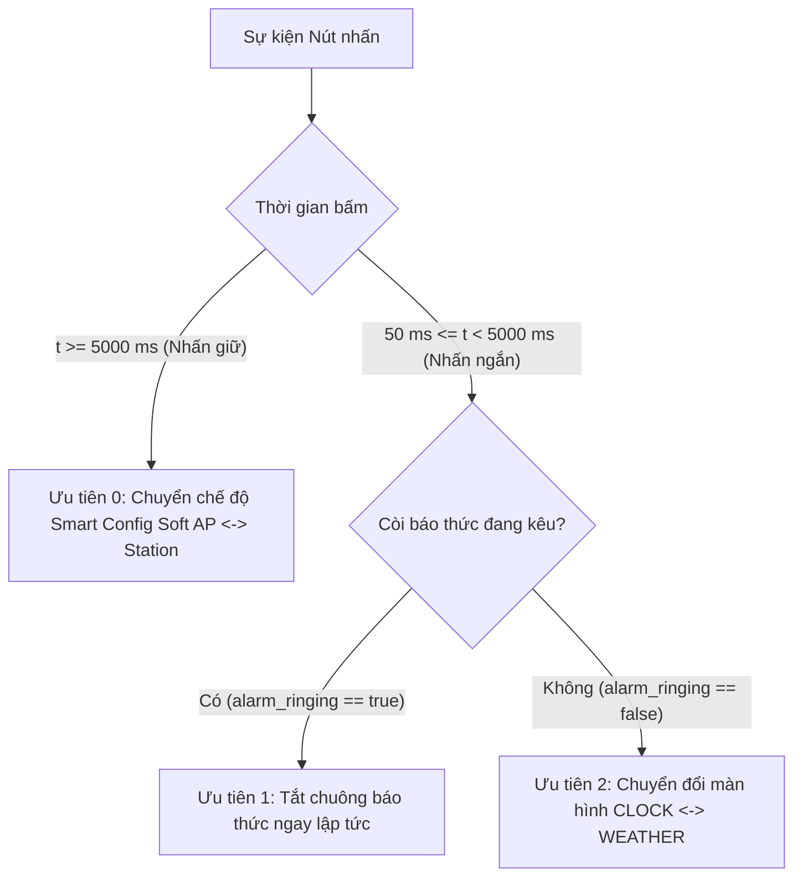

# SMART WEATHER ALARM CLOCK — Project 2 (Embedded Linux)

> **Học viên:** Lê Phúc Tài  
> **Lớp:** DevLinux Embedded Linux K26.1  
> **Phần cứng mục tiêu:** Raspberry Pi Zero W / Zero 2W (BCM2835 / BCM2710)  
> **Hệ điều hành:** Yocto Linux (Poky Minimal Kernel 5.15 / 6.1) / Ubuntu 22.04 LTS  

---

## 1. Giới thiệu Dự án

**Smart Weather Alarm Clock** là dự án đồng hồ báo thức kiêm hiển thị thời tiết trên Raspberry Pi Zero W / Zero 2W. Dự án kết hợp giữa lập trình driver trong nhân Linux (kernel-space) và ứng dụng đa luồng trong không gian người dùng (user-space).

Dự án được xây dựng và phát triển theo từng giai đoạn: phiên bản v1.0 sử dụng character driver truyền thống, và phiên bản v2.0 nâng cấp lên kiến trúc driver chuẩn, tối ưu hiển thị màn hình và kết nối dịch vụ cloud.

### Những điểm cải tiến trong phiên bản v2.0:
1. **Chuẩn hóa driver nút nhấn bằng Input Subsystem (`evdev`):** Chuyển từ character device tự viết sang `struct input_dev`, phát sinh mã sự kiện chuẩn `EV_KEY` (`KEY_POWER`) qua `/dev/input/event*`. Ứng dụng đọc sự kiện qua API input chuẩn của Linux thay vì đọc file device riêng.
2. **Theo dõi thông số driver qua Sysfs:** Cung cấp 2 node `/sys/devices/platform/.../press_count` (đếm số lần nhấn) và `debounce_drops` (số ngắt rung đã lọc) để dễ kiểm tra trạng thái hoạt động của phím trực tiếp từ dòng lệnh.
3. **Bảo vệ hệ thống bằng Hardware Watchdog (`/dev/watchdog`):** Kích hoạt watchdog phần cứng của chip BCM2835 với chu kỳ 15 giây. Luồng đồng hồ ping định kỳ mỗi 1 giây; nếu có luồng bị deadlock hoặc crash quá 15 giây thì chip sẽ tự reset. Khi ứng dụng tắt bình thường, chương trình gửi ký tự `'V'` (magic close) để tắt watchdog an toàn.
4. **Tối ưu truyền dữ liệu OLED qua cơ chế Dirty-Page:** Sử dụng buffer bóng (shadow buffer) để so sánh từng page trước khi gửi qua I2C. Những page không có thay đổi (ví dụ khi chỉ có số giây nhảy ở giữa màn hình) sẽ được bỏ qua, giúp giảm từ 75% đến 90% lưu lượng truyền trên bus I2C.
5. **Vẽ icon bitmap và nguyên ngữ đồ họa bằng số nguyên:** Bổ sung các hàm vẽ đường thẳng (Bresenham) và đường tròn chỉ dùng phép toán số nguyên (không dùng `float`), kèm bộ icon bitmap 1-bit gồm cột sóng Wi-Fi, trạng thái Soft AP, chuông báo thức và biểu tượng thời tiết.
6. **Lấy dữ liệu thời tiết thực tế qua HTTPS (Open-Meteo):** Dùng OpenSSL kết nối HTTPS tới `api.open-meteo.com` (miễn phí, không cần API key), tự giải mã JSON để lấy nhiệt độ, độ ẩm và trạng thái thời tiết. Nếu mất mạng, hệ thống tự động chuyển về dùng server giả lập nội bộ.
7. **Giám sát và điều khiển từ xa qua MQTT (MQTT-C):** Tích hợp thư viện MQTT-C gọn nhẹ (~15 KB), kết nối tới broker HiveMQ:
   * **Gửi dữ liệu (Publish):** Định kỳ 30 giây gửi trạng thái của đồng hồ (nhiệt độ, độ ẩm, giờ báo thức, màn hình hiện tại) lên topic `smartclock/tai/telemetry`.
   * **Nhận lệnh (Subscribe):** Lắng nghe lệnh từ topic `smartclock/tai/command` để tắt còi báo thức, chỉnh giờ báo thức hoặc chuyển màn hình từ xa.

---

## 2. Sơ đồ Nối chân Phần cứng (Hardware Pinout)

| Thiết bị Ngoại vi | Chân SoC (BCM) | Chân Header (Physical Pin) | Chế độ Hoạt động / Giao thức |
|---|---|---|---|
| **Nút nhấn (Button)** | `GPIO 17` | Pin 11 | Input, Active-Low, Internal Pull-Up, Dual-Edge IRQ |
| **Còi Buzzer** | `GPIO 27` | Pin 13 | Output, Active-High, PWM/hrtimer 2000 Hz |
| **OLED SSD1306 SDA** | `GPIO 2` | Pin 3 | I2C-1 Data (`/dev/i2c-1`, Address `0x3C`) |
| **OLED SSD1306 SCL** | `GPIO 3` | Pin 5 | I2C-1 Clock (`/dev/i2c-1`, Address `0x3C`) |
| **Nguồn VCC / GND** | `3.3V / GND` | Pin 1 / Pin 6, 9 | Cấp nguồn cho OLED, Nút nhấn, Buzzer |

---

## 3. Cấu trúc Thư mục Dự án

```text
SmartClock/
├── README.md                          # Hướng dẫn tổng quan, sơ đồ nối chân, build & run
├── devicetree/
│   ├── smartclock-overlay.dts         # Source Device Tree Overlay (GPIO 17, 27, I2C1)
│   └── smartclock-overlay.dtbo        # Binary Device Tree Blob đã biên dịch
├── docs/
│   ├── test_report.md                 # Báo cáo kết quả kiểm thử & kịch bản debug
│   ├── debug_logs/
│   │   ├── helgrind.log               # Log phân tích đa luồng Helgrind
│   │   ├── valgrind.log               # Log phân tích bộ nhớ Valgrind Memcheck
│   │   ├── strace.log                 # Log theo dõi syscalls
│   │   └── gdb.log                    # Log kiểm thử GDB backtrace worker threads
│   └── demo/
│       └── demo_links.txt             # Đường dẫn video demo
├── include/
│   └── smartclock_common.h            # Header dùng chung Kernel & Userspace
├── src/
│   ├── Makefile                       # Top-level Makefile
│   ├── driver/
│   │   ├── Makefile                   # Kbuild Makefile cho Kernel Modules
│   │   ├── btn_driver.c               # Driver nút nhấn (Input subsystem / evdev)
│   │   └── buzzer_driver.c            # Driver còi buzzer hrtimer 2 kHz
│   └── app/
│       ├── Makefile                   # Makefile biên dịch ứng dụng Userspace
│       ├── main.c                     # Khởi tạo hệ thống, watchdog, điều phối luồng
│       ├── system_state.h             # Cấu trúc Shared State & Mutex boundary
│       ├── clock_screen.c/.h          # Màn hình đồng hồ (timerfd 1s)
│       ├── weather_screen.c/.h        # Màn hình thời tiết (Open-Meteo HTTPS / mock fallback)
│       ├── alarm_manager.c/.h         # Quản lý báo thức, kích còi, Atomic Write config
│       ├── smartconfig.c/.h           # Quản lý mạng Soft AP <-> Station, SNTP client
│       ├── webserver.c/.h             # HTTP server cấu hình nhúng (Port 8080)
│       ├── ssd1306_oled.c/.h          # Driver OLED I2C với dirty-page update & 2D primitives
│       ├── ssd1306_icons.h            # Bộ icon bitmap (Wi-Fi, Soft AP, chuông, thời tiết)
│       ├── mqtt_client.c/.h           # Client MQTT điều khiển và gửi telemetry
│       └── mqtt/                      # Thư viện MQTT-C gọn nhẹ
└── systemd/
    └── smartclock.service             # Systemd Unit File tự khởi động cùng OS
```

---

## 4. Ma trận Xử lý Nút nhấn theo Ngữ cảnh (Button Priority Matrix)

Nút nhấn vật lý (GPIO 17) được quản lý tập trung và phân loại sự kiện nguyên tử dưới một Lock Mutex duy nhất (`g_state_mutex`):



| Mức Ưu tiên | Ngữ cảnh Hệ thống | Hành động Nhấn | Kết quả Xử lý |
|---|---|---|---|
| **Ưu tiên 0** *(Ngắt ngầm)* | Bất kỳ lúc nào (Chuông kêu hoặc không) | Nhấn giữ $\ge 5\text{s}$ | Chuyển đổi qua lại giữa **Soft AP** và **Station**. Nếu còi đang kêu, tự động tắt còi trước khi chuyển mạng. |
| **Ưu tiên 1** *(Cao nhất khi reo)* | Còi báo thức đang kêu (`alarm_ringing == true`) | Nhấn ngắn ($< 5\text{s}$) | **Tắt còi báo thức ngay lập tức** (`alarm_ringing = false`). Giữ nguyên màn hình hiện tại. Lần nhấn tiếp theo quay về luồng thường. |
| **Ưu tiên 2** *(Bình thường)* | Còi không kêu (`alarm_ringing == false`) | Nhấn ngắn ($< 5\text{s}$) | **Chuyển đổi màn hình** hiển thị trên OLED (`CLOCK` $\leftrightarrow$ `WEATHER`). |

---

## 5. Hướng dẫn Biên dịch & Chạy Ứng dụng

### 5.1 Biên dịch toàn bộ Dự án
```bash
cd src/
make clean
make all      # Biên dịch cả Kernel Drivers và Userspace Application
```

### 5.2 Nạp Device Tree & Drivers trên Raspberry Pi
```bash
# 1. Nạp Device Tree Overlay
sudo dtoverlay devicetree/smartclock-overlay.dtbo

# 2. Nạp 2 Character Device Drivers
sudo insmod src/driver/btn_driver.ko
sudo insmod src/driver/buzzer_driver.ko

# 3. Phân quyền truy cập các Device Nodes
sudo chmod 666 /dev/btn_driver /dev/buzzer_driver /dev/i2c-1

# 4. Tạo thư mục cấu hình hệ thống
sudo mkdir -p /etc/smartclock /etc/wpa_supplicant /var/lib/misc
```

### 5.3 Chạy Ứng dụng
* **Chạy trực tiếp từ Terminal:**
  ```bash
  sudo ./src/app/smartclock
  ```
* **Chạy dưới dạng Dịch vụ Systemd (Tự khởi động cùng OS):**
  ```bash
  sudo cp systemd/smartclock.service /etc/systemd/system/
  sudo cp src/app/smartclock /usr/bin/
  sudo systemctl daemon-reload
  sudo systemctl enable smartclock.service
  sudo systemctl start smartclock.service
  ```

---

## 6. Bảng Đối chiếu Yêu cầu Đề bài (Requirement Coverage)

| ID Yêu cầu | Mô tả Chức năng | File Source Code thực thi | Trạng thái |
|---|---|---|---|
| `P2-M1` | Driver nút nhấn GPIO ngắt + Chuyển đổi Soft AP $\leftrightarrow$ Station | `src/driver/btn_driver.c`<br>`src/app/smartconfig.c` | **Hoàn thành (PASS)** |
| `P2-M2` | Driver buzzer PWM/hrtimer 2000 Hz | `src/driver/buzzer_driver.c`<br>`src/app/alarm_manager.c` | **Hoàn thành (PASS)** |
| `P2-M3` | Đồng bộ thời gian qua SNTP UDP sau khi kết nối Wi-Fi | `src/app/smartconfig.c` | **Hoàn thành (PASS)** |
| `P2-M4` | Màn hình đồng hồ, giây nhảy đều bằng `timerfd` không trôi | `src/app/clock_screen.c` | **Hoàn thành (PASS)** |
| `P2-M5` | Màn hình thời tiết, tự refresh 5 phút, socket non-blocking timeout 5s | `src/app/weather_screen.c` | **Hoàn thành (PASS)** |
| `P2-M6` | Nhấn nút chuyển đổi mượt mà giữa 2 màn hình | `src/app/main.c`<br>`src/app/ssd1306_oled.c` | **Hoàn thành (PASS)** |
| `P2-M7` | Webserver nhúng (port 8080) cấu hình Wi-Fi & Báo thức (Atomic Write) | `src/app/webserver.c`<br>`src/app/alarm_manager.c` | **Hoàn thành (PASS)** |
| `P2-M8` | Kích hoạt còi báo thức đúng giờ:phút đã đặt | `src/app/alarm_manager.c`<br>`src/app/main.c` | **Hoàn thành (PASS)** |
| `P2-M9` | Nhấn nút tắt chuông ngay lập tức, không nhảy nhầm màn hình | `src/app/main.c` | **Hoàn thành (PASS)** |
| `Edge` | Lưu cấu hình bền vững qua Flash, tự phục hồi sau Reboot | `src/app/alarm_manager.c`<br>`src/app/main.c` | **Hoàn thành (PASS)** |
